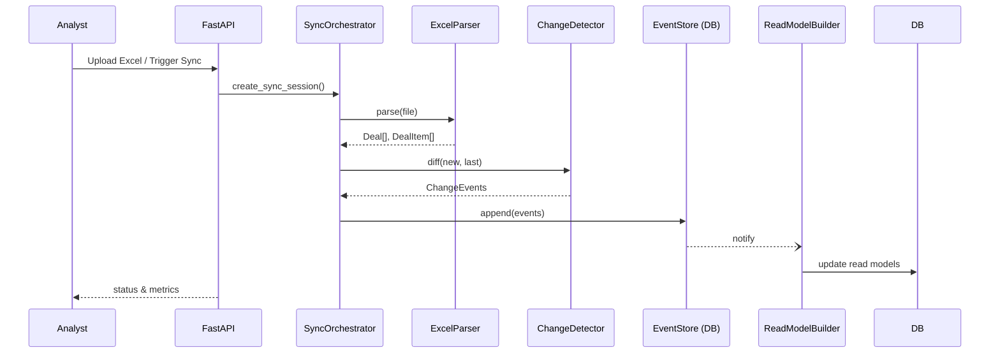

# Project Overview

> Быстрый вводный документ для новых разработчиков. Держите под рукой, чтобы не рыться по всему репозиторию.

## Цель системы
Сервис синхронизации данных из Excel-файлов в PostgreSQL с версионностью, Event-Sourcing и CQRS-read-model.

* Приём Excel от аналитиков
* Парсинг и валидация данных
* Выявление изменений (Change Detector)
* Запись событий в Event Store
* Построение read-model для API / UI
* Управление и мониторинг через FastAPI + React

## Архитектурные слои (DDD)
| Слой | Директория | Краткое содержание |
|------|-----------|--------------------|
| **Domain** | `src/domain` | Модели предметной области, Value Objects, Exceptions, Interfaces |
| **Application** | `src/application` | Сервисы use-case уровня: `excel_parser`, `change_detector`, `sync_orchestrator`, `data_validator` |
| **Infrastructure** | `src/infrastructure` | БД, файловая система, планировщик, воркеры, мониторинг |
| **Presentation** | `src/presentation` | REST API (`FastAPI`), CLI, Web (React + Vite) |

## Главные бизнес-процессы


## Схема основных таблиц (PostgreSQL)
* `event_store` – сырые события
* `deal_read_model` – денормализованные данные для API/UI
* `sync_sessions` – метаданные синхронизаций

Полная DDL лежит в `scripts/create_schema.py`.

## Тестовая пирамида
* **Unit** – `tests/unit` (pytest + pytest-asyncio)
* **Integration** – `tests/integration`, используют тестовую БД/файлы
* **E2E** – `tests/integration/test_e2e_api.py` – полный happy-path через HTTP

Запуск: `python -m pytest` (см. `[tool.pytest.ini_options]` в `pyproject.toml`).

## Линтинг и стиль
* **Ruff** – статический анализ / форматирование import-ов
* **Black** – автоформатирование (PEP8, line-length 100)
* **Mypy** – строгая проверка типов (`strict`) – см. конфиг в `pyproject.toml`

## Быстрый старт для разработки
```bash
# Установка зависимостей (Poetry)
poetry install --with dev,ml

# Локальный запуск API (автоперезагрузка)
poetry run uvicorn src.presentation.api.main:app --reload

# Запуск тестов + линтеров
poetry run ruff check . && poetry run pytest
```

---
_Last update: 2025-07-24_ 